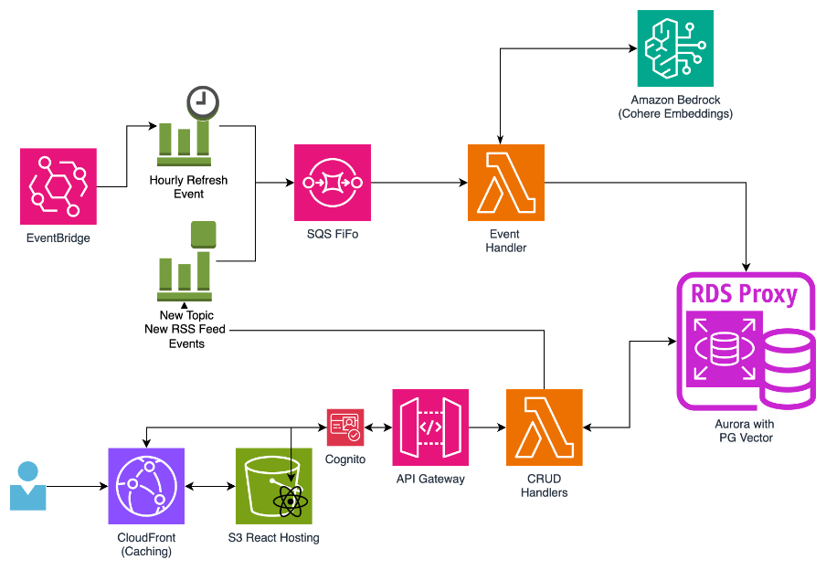

# An RSS Aggregator using Cohere Embeddings for Semantic Search, and Classification

### This project is intended for educational purposes only and not for production use. 

## What is it? 

This application is a complete web application that demonstrates the use of Language Embeddings, namely Cohere V3 Embeddings and Amazon Bedrock to deliver different functionalities. The embeddings are used to quickly categorise articles, allow users to quickly create new topics to categorise articles, and to enable semantic search throughout the articles. 

The application has the following set of functionalities: 

1) Automatically categorise stories based on user and system defined topics.
    * This will be the area that demonstrates the Zero-Shot Classification task. 
    
    

2) Search through articles based on a semantic category. 
	* This will be semantic search, so you will be able to search for things like "Articles about the 2024 Elections" or "topics about uses for AI" for instance.
     


These pieces of functionality are there to demonstrate some of the uses of Language Embeddings, and how they can be used. 

## Live Preview
A live preview of this application is hosted here: https://djwtmt1np1xe4.cloudfront.net

## Goal 
To demonstrate some of the possible uses of these language embeddings we have developed an RSS Aggregator website. This website allows users to subscribe to an RSS feed, and have an aggregated, classified list of the new articles it produces. Here we use embeddings to add the following functionality: 

•	 Zero-Shot Classification: Articles are classified between different topics. There are some default topics, such asTechnology, Politics, Health & Wellbeing. Users can also create their own topics.  
•	Semantic Search: Users can search their articles using semantic search. This not only lets users search for a specific topic, but also to narrow their search by tone or style.

## Technologies Used: 
The RSS application is built entirely with serverless technologies. It is designed to be reactive, using EventBridge and SQS to ingest articles and events. It uses Amazon Bedrock, and Amazon Relational Database Service - Aurora Serverless v2 as the basis for it's embedding and vector capabilities. 

* **Amazon API Gateway** – The API is accessible through Amazon API Gateway. Caching is performed on CloudFront for certain topics to ease database load. 
* **Amazon Bedrock with Cohere v3 Embed** – The articles and topics are converted into embeddings with the help of Amazon Bedrock and Cohere v3 Embed. 
* **Amazon CloudFront and Amazon S3** – The single-page React application is hosted using Amazon Simple Storage Service (Amazon S3) and Amazon CloudFront.
* **Amazon Cognito** – Authentication is done using Amazon Cognito user pools.
* **Amazon EventBridge** – Amazon EventBridge and EventBridge schedules are used to coordinate new updates.
* **AWS Lambda** – The API is a Fastify application written in TypeScript. It is hosted on AWS Lambda. 
* **Amazon Aurora PostgreSQL and pgvector** – Amazon Aurora PostgreSQL-Compatible Edition is used as the database, both for the functionality of the application itself and as a vector store using pgvector.
* **Amazon RDS Proxy** – Amazon RDS Proxy is used for pooling.
* **Amazon SQS** – Amazon Simple Queue Service (Amazon SQS) is used to queue events. It consumes one event at a time to prevent hitting the rate limit of Cohere in Amazon Bedrock.

## Note on Production.

Some services are omitted for cost optimisation reasons. For instance, in a production system it is recommended to use [AWS Web Application Firewall](https://aws.amazon.com/waf/) to protect against common exploits. Additionally, we have left some things optional. For instance, RDS Proxy can be enabled, and for production workloads this is recommended. By default, this is disabled, to optimise around cost. 

## Architecture Diagram


## Deployment

This application uses the CDK to deploy it's infrastructure. 

### Prerequisites
To deploy this application in your own account, you need the following prerequisites:

* An active AWS account.
* Model access for Cohere Embed English. On the Amazon Bedrock console, choose Model access in the navigation pane, then choose Manage model access. Select the FMs of your choice and request access.

  

* The AWS Cloud Development Kit (AWS CDK) set up. For installation instructions, refer to Getting started with the AWS CDK.
* A virtual private cloud (VPC) set up with access to private VPCs. For more information, see Create a VPC. 

### Deploy the AWS CDK stack 
When the prerequisite steps are complete, you’re ready to set up the solution:

1.	Clone the GitHub repository containing the solution files:

```
git clone https://github.com/aws-samples/rss-aggregator-with-bedrock-cohere-embeddings
```

2.	Navigate to the solution directory:

```
cd infrastructure
```

5.	In your terminal, export your AWS credentials for a role or user in ACCOUNT_ID. 

The role needs to have all necessary permissions for AWS CDK deployment:

* `export AWS_REGION="<region>"` 
    * The AWS Region you want to deploy the application to
* `export AWS_ACCESS_KEY_ID="<access-key>"`
    * The access key of your role or user
* `export AWS_SECRET_ACCESS_KEY="<secret-key>"`
    * The secret key of your role or user

6.	If you’re deploying the AWS CDK for the first time, run the following command:

```
cdk bootstrap
```

7.	To synthesize the AWS CloudFormation template, run the following command. You can also toggle the use of rdsProxy with `-c useDbProxy=true`:

```
cdk synth -c vpc_id=<ID Of your VPC>
```

8.	To deploy, use the following command:

```
cdk deploy -c vpc_id=<ID Of your VPC>
```

When deployment is finished, you can see these deployed stacks by visiting the AWS CloudFormation console, as shown in the following screenshot.

 
### Clean up
Run the following command in the terminal to delete the CloudFormation stack provisioned using the AWS CDK:

```
cdk destroy --all
```
